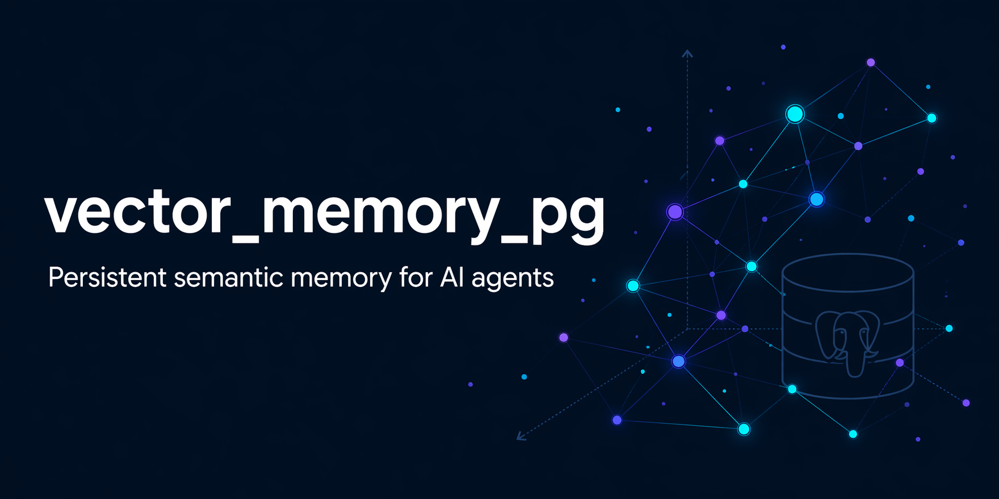

# vector_memory_pg



**Memoria tecnica persistente para agentes IA** — PostgreSQL + pgvector + OpenAI embeddings + HTTP API + MCP.

[Instalacion](./docs/installation.md) • [CLI](./docs/cli.md) • [HTTP API](./docs/http-api.md) • [MCP](./docs/mcp.md) • [Seguridad](./docs/security.md) • [Arquitectura](./docs/architecture.md) • [Roadmap](./docs/mejoras.md) • [Contribuir](./CONTRIBUTING.md)

---

Tu agente olvida todo al terminar la sesion. `vector_memory_pg` le da memoria.

Una base de conocimiento institucional y consultable: sesiones, decisiones tecnicas, reglas por repo, arquitectura, bugs conocidos y convenciones que el agente puede recuperar antes de proponer o ejecutar cambios. Separada por organizacion, proyecto y repositorio. Con control de vigencia y criticidad.

```text
Sesiones JSONL + Markdown + save_memory
        |
        v
OpenAI API  →  text-embedding-3-small, 1536 dims
        |
        v
PostgreSQL + pgvector
        |-- vector(1536) + HNSW  (semantico)
        |-- tsvector + GIN       (full-text)
        |-- metadata + vigencia + criticidad
        |
        |-- HTTP API local  :3010
        |-- MCP Server stdio
        `-- CLI vector-memory
```

## Quick Start

```bash
git clone https://github.com/cabupy/vector_memory_pg.git
cd vector_memory_pg
npm install
cp .env.example .env   # agregar DATABASE_URL y OPENAI_API_KEY
npm run setup          # crea schema en PostgreSQL
npm run server         # HTTP API en :3010
```

Verificar instalacion:

```bash
npm link
vector-memory doctor
```

Conectar a un agente → [docs/mcp.md](./docs/mcp.md)

## Caracteristicas

- Busqueda hibrida: similitud vectorial (70%) + PostgreSQL Full-Text Search (20%).
- Ranking por status, criticidad y fecha de verificacion.
- Metadata por organizacion, proyecto, repo, tipo, estado, criticidad y tags.
- Control de vigencia: `active`, `deprecated`, `superseded`, `archived`.
- Escritura desde MCP: `save_memory`, `update_memory`, `deprecate_memory`, `verify_memory`.
- CLI `vector-memory`: `init-project`, `doctor`, `ingest`, `search`.
- Ingesta incremental de Markdown y JSONL con deteccion de cambios por `mtime`.
- Seguridad en dos capas: denylist de paths + detector de secretos con modos `block` y `redact`.
- Dry-run de ingesta y log de sanitizacion auditadle.

## Documentacion

| Doc | Descripcion |
|---|---|
| [Instalacion](./docs/installation.md) | Requisitos, setup, variables de entorno |
| [CLI](./docs/cli.md) | `init-project`, `doctor`, `ingest`, `search` |
| [HTTP API](./docs/http-api.md) | Endpoints, parametros, ejemplos |
| [MCP](./docs/mcp.md) | Config por agente, herramientas disponibles |
| [Seguridad](./docs/security.md) | Denylist, detector de secretos, dry-run, log |
| [Arquitectura](./docs/architecture.md) | Modelo de datos, ranking, indices, estructura |
| [Roadmap](./docs/mejoras.md) | Mejoras planificadas y estado |
| [Contribuir](./CONTRIBUTING.md) | Como abrir PRs y reportar issues |

## Contribuciones

Bugs, mejoras, documentacion, ideas de arquitectura y PRs son bienvenidos.

Revisa [CONTRIBUTING.md](./CONTRIBUTING.md) antes de abrir un PR.

## Creditos

Inspirado por el tutorial de [Carlos Azaustre](https://carlosazaustre.es/blog/memoria-vectorial-openclaw-tutorial), evolucionado hacia una memoria tecnica persistente e institucional para agentes IA.

Autor: [Carlos Vallejos (cabupy)](https://github.com/cabupy)

## Licencia

MIT. Ver [LICENSE](./LICENSE).
